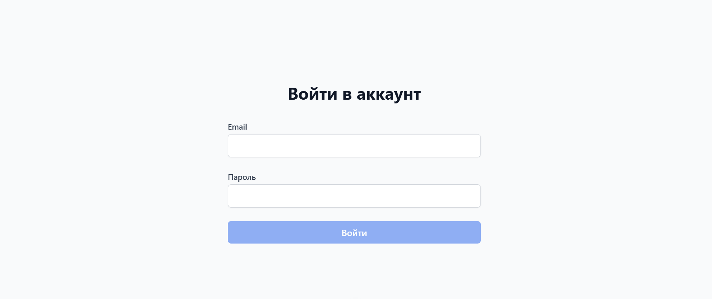
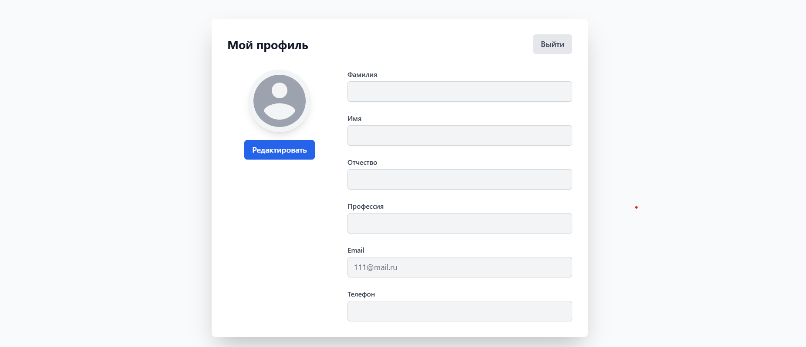

# AuthorizationApp-Vue.JS (Vue.JS / Tailwind CSS)

## Обзор 🌟

Приложение для регистрации и входа пользователей с личным кабинетом. При регистрации пользователь создает аккаунт, указывая email и надежный пароль. После входа доступен личный кабинет, где можно загрузить фото профиля, изменить личные данные и настройки аккаунта. 

### [Посмотреть демо 👈](https://subbotinroman.github.io/AuthorizationApp-Vue.JS/#/login) 




---

## Стек технологий ⚙️


---

## Возможности 🚀

- 🔒 Безопасная система аутентификации с проверкой надежности пароля
- 👤 Расширенное управление профилем с редактируемыми данными пользователя
- 🖼️ Загрузка аватара с валидацией изображений и предпросмотром
- ✨ Современный интерфейс на основе Tailwind CSS
- ⚡ Молниеносная производительность благодаря Vite
- 💾 Сохранение данных с помощью localStorage

---

## Как запустить локально 💻

1. Клонируйте репозиторий:
```bash
git clone https://github.com/SubbotinRoman/AuthorizationApp-Vue.JS.git
```

2. Перейдите в папку с проектом:
```bash
cd AuthorizationApp-Vue.JS
```

3. Установите зависимости через npm:
```bash
npm install
```

Или через yarn:
```bash
yarn
```

4. Запустите локальный сервер через npm:
```bash
npm run dev
```

Или через yarn:
```bash
yarn dev
```
